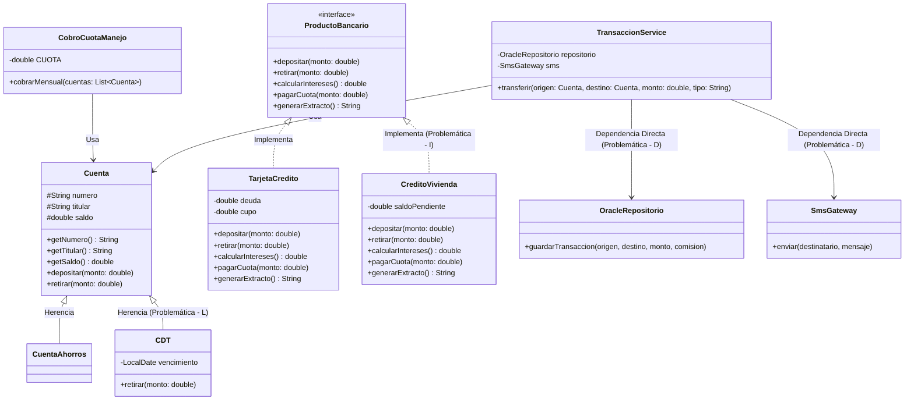

# Laboratorio-SOLID
Laboratorio numero 2 de la matera de ingenieria de software realizado por Jader Camilo Rodriguez Arboleda y

## Qué hace el sistema
  - Transfiere dinero entre cuentas, cobra la comisión según el tipo de transferencia, guarda la
  transacción en Oracle, imprime el comprobante, avisa al cliente por SMS y deja un registro
  de auditoría.
  - Cobra la cuota de manejo mensual a una lista de cuentas.
  - Genera extractos de los productos de crédito (tarjeta y crédito de vivienda).
  La conexión a Oracle y el envío de SMS están simulados con mensajes en consola, pero
  imaginen que son reales: cada vez que se ejecutan, el sistema se conecta a la base de datos de
  producción y le llega un mensaje de texto al cliente.

-----------------------------------------------------------

## Recorrido del laboratorio

| Bloque | Qué van a hacer |
|---|---|
| 0. Arranque | Preparar el proyecto y conocer el dominio |
| 1. Diagnóstico | Encontrar los problemas y medir el “antes” |
| 2. Refactorización | Corregir el sistema con puntos de control S, O, L, I, D |
| 3. Pruebas unitarias | Probar el diseño nuevo con dobles de prueba |
| 4. Negocio pidió cambios | Implementar requerimientos que no conocían |
| 5. Revisión cruzada | Extender el código de otra pareja |
| 6. Cierre | UML final, comparación y reflexión |

## Glosario bancario

| Término | Significado en este laboratorio |
|---|---|
| Cuenta de ahorros | Cuenta en la que el cliente deposita, retira y transfiere dinero libremente. |
| CDT | Certificado de Depósito a Término. El cliente deja un dinero “congelado” hasta una fecha de vencimiento a cambio de intereses. No permite retiros antes de esa fecha. |
| Cuota de manejo | Valor mensual que el banco cobra por mantener una cuenta. |
| Transferencia interbancaria | Transferencia hacia una cuenta de otro banco. Tiene comisión. |
| Avance | Retiro de efectivo con cargo al cupo de una tarjeta de crédito. |
| Extracto | Resumen del estado de un producto (saldo, deuda, etc.). |

## Bloque 0 — Arranque

Preparar el proyecto y entender qué hace el sistema antes de juzgarlo.

1. Creen el proyecto en el lenguaje elegido y copien (o traduzcan) el código base.
2. Ejecuten el programa principal y guarden su salida en un archivo `salida_original.txt`.
La usarán en el bloque 2 para comprobar que no cambiaron el comportamiento.

3. Lean el código completo una vez, sin tomar notas, solo para entender el flujo de una transferencia.

**Commit:** `bloque-0-codigo-base`

## Bloque 1 — Diagnóstico

Encontrar los problemas de diseño y medir cómo está el sistema antes de tocarlo.

### 1.1 Tabla de hallazgos

En el código hay al menos un problema por cada letra de SOLID, y algunas clases tienen más de uno. Encuéntrenlos y regístrenlos en una tabla como esta en su README:

| Clase / método | Letra | Evidencia en el código | Consecuencia para el banco o el cliente |
| :--- | :--- | :--- | :--- |
| `TransaccionService` / `transferir` | **S** | Mezcla validación, comisiones, movimientos, conexión a Oracle, comprobante en consola y SMS. | Si cambia el formato del SMS o la base de datos, se toca la lógica financiera, arriesgando un error en el dinero de los clientes. |
| `TransaccionService` / `transferir` | **O** | El cálculo de la comisión usa un `switch (tipo)` quemado en el código. | Agregar un nuevo tipo de transferencia obliga a modificar y arriesgar el código central, en lugar de solo añadir código nuevo. |
| `CDT` / `retirar` | **L** | Hereda de `Cuenta`, pero lanza `UnsupportedOperationException` si se retira antes de tiempo. | El cobro nocturno a un millón de cuentas fallará y se detendrá al llegar a un CDT, dejando cuentas sin cobrar. |
| `TarjetaCredito` y `CreditoVivienda` / `depositar`, `retirar` | **I** | Implementan la interfaz `ProductoBancario` dejando métodos vacíos o que dicen "// no aplica". | Productos de crédito están acoplados a operaciones de cuentas de ahorro; cambios en retiros pueden obligar a alterar tarjetas. |
| `TransaccionService` / Atributos | **D** | Crea `new OracleRepositorio()` y `new SmsGateway()` directamente. | Es imposible probar el cálculo de comisiones sin conectarse a la base de datos de producción o enviarle SMS reales al cliente. |

### Sobre la columna “consecuencia”

No escriban “viola el SRP”. Escriban qué le pasa al negocio. Por ejemplo: “si mañana cambia el texto del SMS hay que tocar la misma clase que mueve el dinero, y un error ahí puede cobrar mal una transferencia”.

### 1.2 Dos experimentos

1. El CDT. Modifiquen temporalmente el programa principal para que el cobro de la cuota de manejo incluya el CDT de Ana. ¿Qué pasa? ¿Qué pasaría en producción si el proceso de cobro corre de noche para un millón de cuentas y la cuenta número 500 000 es un CDT?
- Al incluir el CDT de Ana en el cobro de la cuota de manejo, el programa lanza la excepción UnsupportedOperationException y se cae de inmediato. En producción, si este cobro se lanza de madrugada para millones de cuentas, el proceso fallaría a la mitad. Todos los clientes después de ese CDT no recibirían el cobro de la cuota.

2. La prueba imposible. Intenten escribir una prueba unitaria que verifique que una transferencia a otro banco cobra $7.500 de comisión, con una condición: la prueba no puede conectarse a Oracle ni enviar un SMS. ¿Lo lograron? ¿Qué les impide hacerlo?
- No se pudo hacer. El impedimento principal es que TransaccionService instancia directamente (new) a OracleRepositorio y SmsGateway. Como no podemos inyectarle mocks, siempre va a intentar imprimir los mensajes de Oracle y SMS en consola, simulando que va a producción.

### 1.3 Medición “antes”

| Métrica | Antes |
|---|---|
| Líneas del método transferir | 34 |
| Número de razones distintas por las que TransaccionService podría cambiar | 6 (Validaciones, comisiones, lógica de cuenta, persistencia, consola, notificaciones) |
| Clases concretas que TransaccionService crea con new | 2 (OracleRepositorio, SmsGateway) |
| Métodos vacíos o que lanzan excepción por “no aplica” | 5 |
| ¿Se puede probar transferir sin Oracle ni SMS? (Sí/No) | No |

### 1.4 Diagrama de clases del código original

Dibujen el diagrama de clases UML del código base: clases, interfaces, herencia, implementación y dependencias (new). Puede ser a mano (foto) o con cualquier herramienta (draw.io, PlantUML, Mermaid, etc.). Marquen en rojo las dependencias o herencias que consideren problemáticas.

**Commit:** `bloque-1-diagnostico`

## Bloque 2 — Refactorización

Corregir el sistema completo, un principio a la vez, sin cambiar su comportamiento.

Trabajen en el orden de los puntos de control. Al terminar cada uno: (1) ejecuten el programa y comparen la salida con salida_original.txt, (2) respondan la pregunta de control en su README y (3) hagan el commit.

Tip: compara la salida automáticamente. En Linux o macOS: `diff salida_original.txt salida_nueva.txt`. En Windows (PowerShell): `Compare-Object (gc salida_original.txt) (gc salida_nueva.txt)`. Solo deberían cambiar la fecha y la hora de la auditoría. A esta técnica se le llama prueba de caracterización: antes de refactorizar código sin pruebas, se “congela” lo que hace hoy para detectar cualquier cambio accidental.

### Punto de control S

Separen las responsabilidades que hoy están mezcladas en TransaccionService.transferir.

#### Comparación de salida
- InputObject                                                                   SideIndicator
-----------                                                                   -------------
[AUDITORIA] 2026-10-03T18:10:07.912531800 OTRO_BANCO 001-1 -> 001-2 $150000.0 =>

[AUDITORIA] 2026-10-01T17:18:12.308827743 OTRO_BANCO 001-1 -> 001-2 $150000.0 <=

#### Pregunta de control

 - Después del cambio, describan en una frase qué hace TransaccionService. ¿Aparece la palabra “y”? Si el área legal pide cambiar el formato del comprobante, ¿qué archivo tocan?
     - TransaccionService coordina el proceso de una transferencia (validación, comisión y movimiento de dinero).
     - Si el área legal pide cambiar el formato del comprobante, solo se toca el archivo ComprobanteConsola.java.

**Commit:** `control-S`

### Punto de control O

Hoy, agregar un tipo de transferencia obliga a editar el switch. Cámbienlo para que un tipo nuevo se agregue creando código, no editando el existente.

#### Comparación de salida
InputObject                                                                   SideIndicator
-----------                                                                   -------------
[AUDITORIA] 2026-10-03T18:28:59.851162 OTRO_BANCO 001-1 -> 001-2 $150000.0    =>

[AUDITORIA] 2026-10-01T17:18:12.308827743 OTRO_BANCO 001-1 -> 001-2 $150000.0 <=

#### Pregunta de control

- Si mañana llega un tipo de transferencia nuevo, ¿qué archivos existentes tendrían que modificar? Enumérenlos. Lo ideal es que solo aparezca el punto donde se arma el sistema (el programa principal).
    - Solo se modificaría Main.java (el lugar donde se arma el sistema).

**Commit:** `control-O`

### Punto de control L

Corrijan la jerarquía de cuentas para que el cobro de cuota de manejo nunca pueda explotar por culpa de un CDT.

#### Comparación  de salida
InputObject                                                                   SideIndicator
-----------                                                                   -------------
[AUDITORIA] 2026-10-03T18:39:52.728209700 OTRO_BANCO 001-1 -> 001-2 $150000.0 =>

[AUDITORIA] 2026-10-01T17:18:12.308827743 OTRO_BANCO 001-1 -> 001-2 $150000.0 <=

#### Pregunta de control

- ¿Su solución detecta el error al compilar (o con el verificador de tipos de su lenguaje) o al ejecutar? ¿Por qué es mejor lo primero? Si alguien propone “envolver el retiro en un try/catch e ignorar los CDT”, ¿por qué eso no resuelve el problema de diseño?
  - La solución detecta el error al compilar.
  - Es mejor porque el fallo se descubre en tiempo de desarrollo, no a las 3 a.m. cuando corre el proceso batch de un millón de cuentas.
  - Envolver el retiro en un try/catch e ignorar los CDT no resuelve el problema de diseño: sigue permitiendo que un CDT se trate como si fuera una cuenta que soporta cobro de cuota, viola el contrato de la jerarquía y oculta el error en lugar de hacerlo imposible.

**Commit:** `control-L`

### Punto de control I

Corrijan ProductoBancario para que ningún producto tenga que implementar métodos que no le aplican.

#### Comparación de salida
InputObject                                                                            SideIndicator
-----------                                                                            -------------
[ORACLE] INSERT INTO transacciones VALUES (001-1,001-2, 150000.0, 7500.0)  =>

[AUDITORIA] 2026-10-03T19:23:25.115719900 OTRO_BANCO 001-1 -> 001-2 $150000.0          =>

[ORACLE] INSERT INTO transacciones VALUES (001-1, 001-2, 150000.0, 7500.0) <=

[AUDITORIA] 2026-10-01T17:18:12.308827743 OTRO_BANCO 001-1 -> 001-2 $150000.0          <=
#### Pregunta de control

- ¿Pudieron lograr que un mismo generador de extractos funcione para cuentas, tarjetas y créditos a la vez? ¿Qué interfaz necesitó para eso, y por qué no necesitó conocer los demás métodos de cada producto?
  - El mismo generador de extractos puede trabajar con cuentas, tarjetas y créditos mediante la interfaz GenerableExtracto. Esta interfaz contiene únicamente el método relacionado con la generación del extracto, por lo que cada producto que necesite esta funcionalidad la implementa.
    
**Commit:** `control-I`

### Punto de control D

Hagan que TransaccionService deje de crear sus dependencias con new y que dependa de abstracciones. Todo el “armado” del sistema debe quedar en un solo lugar (el programa principal).

#### Comparación salida
InputObject                                                                   SideIndicator
-----------                                                                   -------------
[AUDITORIA] 2026-10-04T11:09:55.814500300 OTRO_BANCO 001-1 -> 001-2 $150000.0 =>

[AUDITORIA] 2026-10-01T17:18:12.308827743 OTRO_BANCO 001-1 -> 001-2 $150000.0 <=

#### Pregunta de control

- ¿Cuántas clases concretas conoce ahora TransaccionService? ¿Quién decide si se usa Oracle o si se notifica por SMS? Vuelvan al experimento 2 del bloque 1: ¿ya es posible esa prueba?
  - Ahora TransaccionService no conoce ninguna clase concreta porque ahora depende de abstracciones (*Repositorio*, *GeneradorComprobante* ,*Notificador* y *Auditor*) y no de implementaciones concretas.
  - El *Main* es el que decide que implementaciones utilizar porque alli se construyen y se pasan las dependencias a *TransaccionService*
  - Con los nuevos codigos ya es posible realizar la prueba del experimento 2 del bloque 1 ya que al depender de abstracciones se pueden reemplazar las implementaciones reales por otras pruebas sin modificar *TransaccionService*
 
**Commit:** `control-D`

## Bloque 3 — Pruebas unitarias

Demostrar que el diseño nuevo se puede probar sin base de datos, sin SMS y en milisegundos.

Dobles de prueba. Un doble de prueba es una implementación falsa de una abstracción, hecha solo para las pruebas. Por ejemplo, un repositorio que guarda las transacciones en una lista en memoria en vez de en Oracle, o un notificador que anota los mensajes en vez de enviarlos. Solo es posible usarlos si la clase que se prueba depende de abstracciones (punto de control D). Si en su lenguaje usan un framework de mocks (Mockito, unittest.mock, Moq, Jest, Vitest, flutter_test, XCTest, go test, etc.), también es válido.

Usen el framework de pruebas de su lenguaje (JUnit, pytest, xUnit, Jest, Vitest, flutter_test, XCTest, go test, etc.) y escriban como mínimo estas pruebas:

1. Una transferencia al mismo banco no cobra comisión y mueve exactamente el monto entre las dos cuentas.
2. Una transferencia a otro banco cobra $7.500 de comisión y descuenta monto + comisión de la cuenta de origen.
3. Si el saldo es insuficiente, la transferencia se rechaza y no se guarda nada ni se notifica al cliente.
4. Cada transferencia exitosa se guarda una sola vez y genera una sola notificación.
5. Un tipo de transferencia desconocido se rechaza y el saldo de la cuenta de origen no cambia.

#### Pregunta de control

**¿Cuánto tardan en ejecutarse todas sus pruebas?**
Tardan apenas unos pocos milisegundos. Al usar dobles de prueba (las clases `Spy` y `Dummy` hechas a mano), eliminamos por completo la necesidad de conectarnos a una base de datos Oracle real o de esperar la respuesta de un proveedor de red para enviar SMS.

**¿Cuántas líneas de `TransaccionService` tuvieron que cambiar para poder probarla?**
Cero (0) líneas. Como la clase ya había sido refactorizada para recibir sus dependencias por el constructor (aplicando el principio de Inversión de Dependencias en el punto D), simplemente le pasamos los dobles de prueba al momento de instanciarla en el test, sin necesidad de modificar su lógica interna.

**¿Qué habría pasado si intentaran estas mismas pruebas en el bloque 1?**
Habría sido imposible ejecutar pruebas unitarias aisladas. En el código original del bloque 1, el servicio creaba sus propias dependencias internamente usando `new OracleRepositorio()` y `new SmsGateway()`. Si hubiéramos corrido un test, el sistema habría intentado conectarse a la base de datos real y enviar mensajes de texto de verdad, lo cual haría la prueba lenta, inestable y peligrosa de ejecutar repetidamente.

**Commit:** `bloque-3-pruebas`

## Bloque 4 — “Negocio pidió cambios”

Poner a prueba el diseño con requerimientos que no conocían.

Al iniciar este bloque, el docente les entregará una hoja con cinco requerimientos nuevos del área de negocio. Para cada uno:

1. Antes de programar, miren el código original (está en el commit bloque-0-codigo-base) y estimen cuántos archivos existentes habría que modificar allí.
2. Implementen el requerimiento sobre su código refactorizado.
3. Registren cuántos archivos existentes modificaron realmente y cuántos archivos nuevos crearon.
4. Ejecuten las pruebas del bloque 3: deben seguir pasando.

| Req. | Archivos a modificar en el código original (estimado) | Archivos existentes modificados (real) | Archivos nuevos | ¿Se rompió alguna prueba? |
|---|---|---|---|---|
| **R1** | `TransaccionService.java` | `Main.java` | `ComisionLlave.java` | No |
| **R2** | `Cuenta.java`, `CobroCuotaManejo.java` | `Main.java` | `CuentaInfantil.java` | No |
| **R3** | `TransaccionService.java` | `Main.java` | `PushGateway.java`, `NotificadorMultiple.java` | No |
| **R4** | `TransaccionService.java` | `TransaccionService.java`, `Main.java` | `SistemaAntifraude.java`, `AntifraudeConsola.va` | No |
| **R5** | `TransaccionService.java` | `Main.java` | `PostgreSQLRepositorio.java` | No |

**Commit:** uno por requerimiento: `req-1`, `req-2`, . . . , `req-5`

## Bloque 5 — Revisión cruzada

Comprobar si el diseño es fácil de extender para alguien que no lo escribió.

1. Intercambien su repositorio con otra pareja (el docente indica con cuál). No pueden explicarle su código: el código debe explicarse solo.
2. El docente entregará un requerimiento nuevo. Impleméntenlo sobre el código de la otra pareja.
3. Llenen la lista de revisión y entréguensela a la otra pareja.

### Lista de revisión

| Lista de revisión | Sí | No |
|---|---|---|
| Entendimos qué hace cada clase leyendo solo su nombre y sus métodos públicos. | | |
| Pudimos reutilizar piezas existentes sin copiar y pegar código. | | |
| Implementamos el requerimiento sin modificar la lógica de clases existentes. | | |
| No encontramos métodos vacíos ni que lancen “no aplica”. | | |
| No encontramos if/switch por tipo que tuvimos que extender. | | |
| Las pruebas existentes siguieron pasando después de nuestro cambio. | | |
| No encontramos abstracciones innecesarias (interfaces que no aportan). | | |

**Lo mejor del diseño:**

**Lo que nos costó entender o extender:**

**Commit (en el repositorio de la otra pareja, en una rama):** `revision-cruzada`

## Bloque 6 — Cierre

Ver el cambio completo y reflexionar sobre lo aprendido.

1. Dibujen el diagrama de clases UML del código final y pónganlo al lado del diagrama del bloque 1.

2. Completen la tabla comparativa:

| Métrica | Antes | Después |
|---|---|---|
| Líneas del método transferir | | |
| Razones distintas por las que TransaccionService podría cambiar | | |
| Clases concretas que TransaccionService crea con new | | |
| Métodos vacíos o que lanzan “no aplica” | | |
| ¿Se puede probar transferir sin Oracle ni SMS? | | |
| Número total de archivos | | |
| Archivos existentes modificados en total en el bloque 4 | | |

3. Respondan en su README:

**(a)** El código final tiene muchos más archivos que el original. ¿Es eso un problema? ¿En qué situación sí lo sería?

**(b)** ¿En qué requerimiento del bloque 4 se notó más la diferencia entre el código original y el refactorizado? ¿Por qué?

**(c)** ¿Hubo algún requerimiento que su diseño no aguantó bien? ¿Qué cambiarían?

**(d)** ¿Qué les dijo la otra pareja en la revisión cruzada? ¿Están de acuerdo?

**(e)** Si tuvieran que convencer a su jefe de invertir dos semanas en refactorizar el backend real del banco, ¿qué argumento usarían, basándose en los datos de hoy?

---------------------------
# Complementos

“Buenas tardes, equipo. Estos son los cambios priorizados para el próximo lanzamiento de la app. Gracias por su apoyo.” — Gerencia de Canales Digitales

Recuerden: antes de programar cada requerimiento, estimen cuántos archivos habría que modificar en el código original. Después, implementen sobre su código refactorizado y registren los datos reales en la tabla del bloque 4.

## R1 Transferencias por llave

Los clientes podrán transferir usando una llave (su número de celular o su cédula) en lugar del número de cuenta. Estas transferencias son inmediatas y no tienen comisión.

**Criterio de aceptación:** una transferencia de tipo LLAVE por $50.000 descuenta exacta- mente $50.000 de la cuenta de origen. (Para este laboratorio no es necesario implementar la búsqueda de la cuenta a partir de la llave.)

## R2 Cuenta infantil

Nuevo producto para menores de edad: la cuenta infantil. Recibe depósitos sin límite, pero sus retiros no pueden superar $200.000 en un mismo día. Se debe poder usar como origen de transferencias y se le cobra la cuota de manejo como a cualquier cuenta.

**Criterio de aceptación:** si la cuenta ya retiró $150.000 hoy, un retiro de $60.000 se rechaza y el saldo no cambia.

## R3 Notificaciones push

Además del SMS, el cliente debe recibir una notificación push en la app por cada transferencia.

**Criterio de aceptación:** por cada transferencia exitosa aparecen en consola un mensaje [SMS] y un mensaje [PUSH].

## R4 Sistema antifraude

Por regulación, cada transacción exitosa debe enviarse al sistema antifraude del banco (simulado con un mensaje en consola que empiece con [ANTIFRAUDE]). La auditoría actual se mantiene.

**Criterio de aceptación:** por cada transferencia exitosa aparecen un mensaje [AUDITORIA] y uno [ANTIFRAUDE]. Una transferencia rechazada no genera ninguno.

## R5 Migración a PostgreSQL

El banco dejará de pagar la licencia de Oracle. Las transacciones se guardarán en Post-greSQL (simulado con [POSTGRES]). La clase de Oracle no se borra: se conserva por si hay que devolverse durante la migración.

**Criterio de aceptación:** el programa guarda en PostgreSQL y las pruebas unitarias no cambian.

## Bloque 5 Requerimiento para la revisión cruzada

Este requerimiento se implementa sobre el código de la otra pareja, sin pedirles explicaciones. Si no entienden algo, anótenlo en la lista de revisión: esa es justamente la retroalimentación que les sirve.

## R6 Pago de servicios públicos

Los clientes podrán pagar sus facturas de servicios públicos (agua, luz, gas, internet) desde una cuenta, indicando la referencia de la factura y el valor.

El pago tiene una comisión fija de $1.500.

Aplican las mismas validaciones de monto que en las transferencias.

Como cualquier transacción, el pago se guarda, genera comprobante, notifica al cliente y pasa por auditoría y antifraude.

Un CDT no puede pagar servicios.

**Criterio de aceptación:** un pago de $184.300 descuenta $185.800 de la cuenta, guarda la transacción e imprime el comprobante con la referencia de la factura como destino.

**Restricción:** no se permite copiar y pegar la lógica de TransaccionService. Deben reutilizar las piezas que la otra pareja ya construyó.

## Para pensar mientras lo implementan

¿Cuántas de las piezas que necesitan ya existían en el código de la otra pareja? ¿Pudieron usarlas tal como estaban, o tuvieron que modificarlas? Eso dice mucho de qué tan reutilizable quedó su diseño (y el de ustedes).
